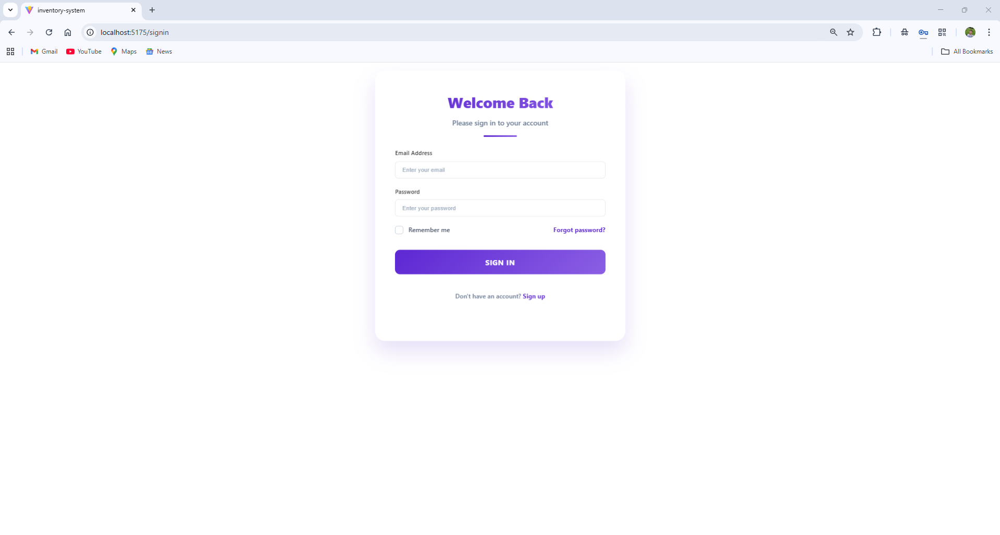
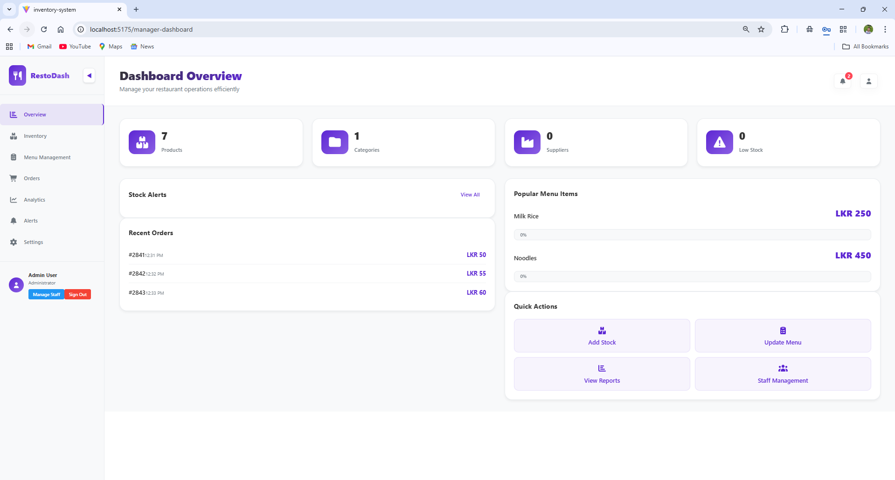
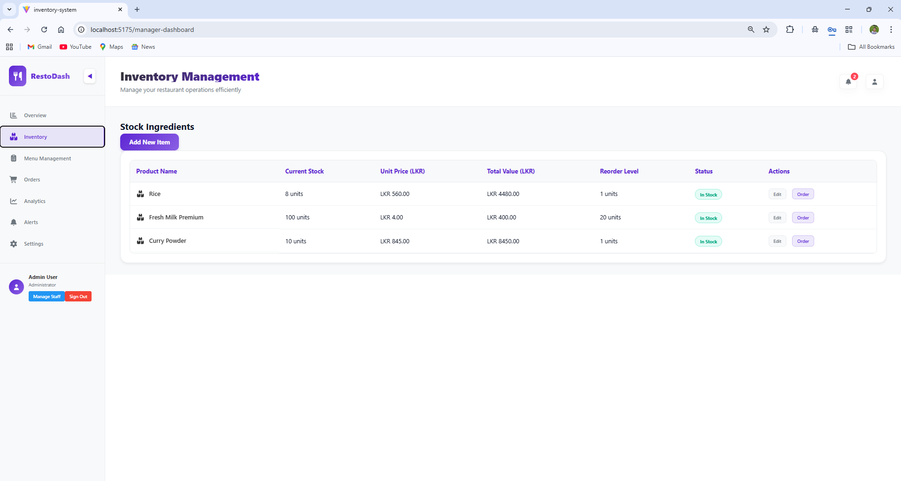
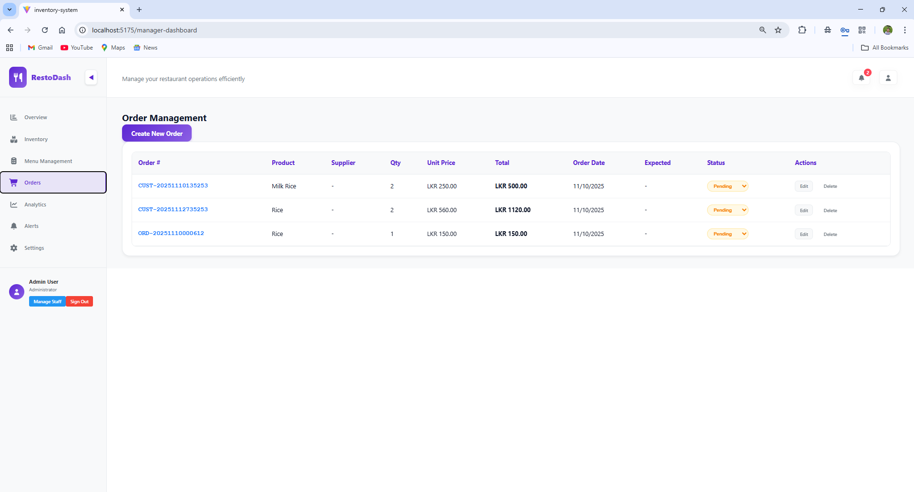
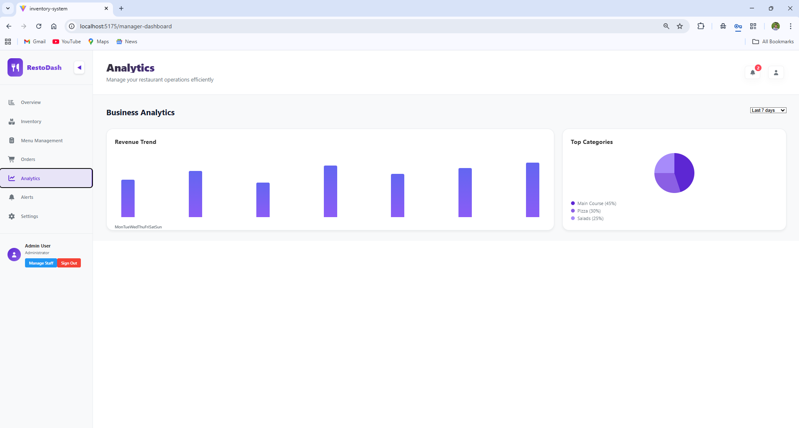
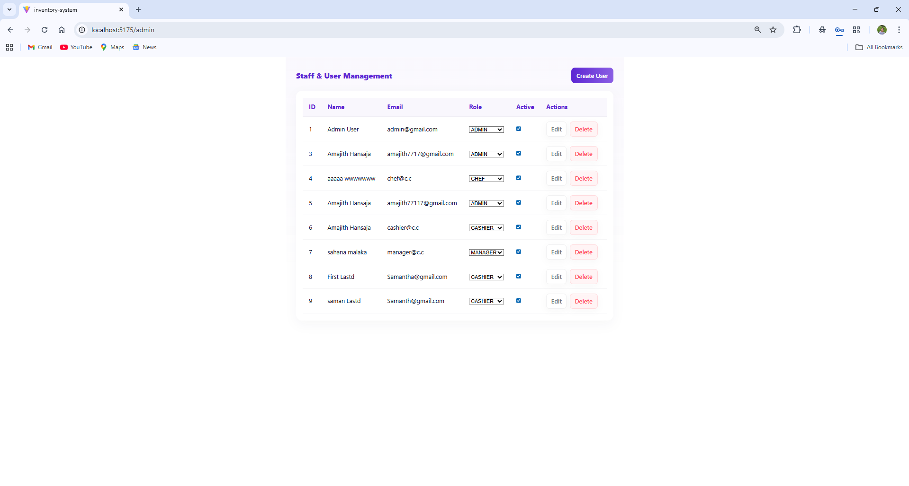

# 🍽️ Restaurant Management System

A full-stack restaurant management system built with **React** (frontend) and **Spring Boot** (backend). This system provides comprehensive inventory management, order tracking, analytics, and user management features for restaurants.


---

## 📋 Table of Contents

- [Features](#-features)
- [Tech Stack](#-tech-stack)
- [Prerequisites](#-prerequisites)
- [Installation & Setup](#️-installation--setup)
- [Running the Application](#-running-the-application)
- [Project Structure](#-project-structure)
- [API Documentation](#-api-documentation)
- [Screenshots](#-screenshots)
- [User Roles](#-user-roles)
- [Troubleshooting](#-troubleshooting)
- [Contributing](#-contributing)
- [License](#-license)

---

## ✨ Features

### 🔐 Authentication & Authorization

- User registration and login with JWT authentication
- Role-based access control (Admin, Manager, Cashier, Chef)
- Password reset functionality
- Protected routes based on user roles

### 📦 Inventory Management

- Add, edit, and delete inventory items
- Track stock levels with reorder thresholds
- Low stock alerts and notifications
- Price tracking and history
- Product categories and supplier management

### 📊 Dashboard & Analytics

- Real-time statistics and metrics
- Role-specific dashboards (Admin, Cashier, Chef)
- Product analytics and reports
- Visual charts and graphs

### 🛒 Order Management

- Create and track customer orders
- Order status management
- Order history and details

### 👥 User Management (Admin)

- Create and manage user accounts
- Assign roles and permissions
- View user activity logs

### 📱 Responsive Design

- Mobile-friendly interface
- Modern and intuitive UI
- Dark/Light theme support

---

## 🛠️ Tech Stack

### Frontend

- **React 19.1.1** - UI library
- **React Router 7.9.4** - Routing
- **Axios 1.12.2** - HTTP client
- **Vite 7.1.7** - Build tool
- **CSS3** - Styling

### Backend

- **Spring Boot 3.2.0** - Application framework
- **Spring Data JPA** - Data persistence
- **Spring Security** - Authentication & authorization
- **JWT** - Token-based authentication
- **MySQL 8.0** - Production database
- **H2** - Development/testing database
- **Maven** - Dependency management

---

## 📋 Prerequisites

Before you begin, ensure you have the following installed:

- **Java 17** or higher - [Download](https://adoptium.net/)
- **Maven 3.6+** - [Download](https://maven.apache.org/download.cgi)
- **Node.js 16+** and npm - [Download](https://nodejs.org/)
- **MySQL 8.0** - [Download](https://dev.mysql.com/downloads/mysql/)
- **Git** - [Download](https://git-scm.com/downloads)

### Check your installations:

```powershell
java -version       # Should show Java 17+
mvn -version        # Should show Maven 3.6+
node -version       # Should show Node 16+
npm -version        # Should show npm 7+
mysql --version     # Should show MySQL 8.0+
```

---

## 🛠️ Installation & Setup

### 1. Clone the Repository

```powershell
git clone https://github.com/NethumiJ/restaurant-management-system.git
cd restaurant-management-system
```

### 2. Database Setup

#### Option A: Using MySQL (Recommended for Production)

1. **Start MySQL** and log in:

```powershell
mysql -u root -p
```

2. **Create the database**:

```sql
CREATE DATABASE inventory_db;
exit;
```

3. **Update database credentials** in `backend/src/main/resources/application.properties`:

```properties
spring.datasource.url=jdbc:mysql://localhost:3306/inventory_db
spring.datasource.username=root
spring.datasource.password=YOUR_PASSWORD
```

#### Option B: Using Docker (Alternative)

```powershell
cd backend
docker-compose up -d
```

This will start MySQL in a Docker container with the correct configuration.

### 3. Backend Setup

```powershell
cd backend

# Install dependencies and build
mvn clean install

# The application will auto-create tables on first run
```

### 4. Frontend Setup

```powershell
# Navigate to project root
cd ..

# Install dependencies
npm install
```

---

## 🚀 Running the Application

### 1. Start the Backend (Port 8080)

```powershell
cd backend
mvn spring-boot:run
```

✅ Backend will be available at: **http://localhost:8080**

You should see output like:

```
Started InventoryApplication in X.XXX seconds
```

### 2. Start the Frontend (Port 5175)

Open a **new terminal** window:

```powershell
# Navigate to project root
cd restaurant-management-system

# Start development server
npm run dev
```

✅ Frontend will be available at: **http://localhost:5175**

### 3. Access the Application

Open your browser and navigate to: **http://localhost:5175**

#### Default Login Credentials:

The system creates a default admin user on first run:

- **Email**: `admin@inventory.com`
- **Password**: `admin123`

---

## 📁 Project Structure

```
restaurant-management-system/
├── backend/                          # Spring Boot backend
│   ├── src/main/java/com/inventory/
│   │   ├── config/                   # Security, JWT, CORS configuration
│   │   ├── controller/               # REST API endpoints
│   │   ├── dto/                      # Data Transfer Objects
│   │   ├── exception/                # Exception handling
│   │   ├── model/                    # Entity classes
│   │   ├── repository/               # JPA repositories
│   │   └── service/                  # Business logic
│   ├── src/main/resources/
│   │   └── application.properties    # Configuration
│   ├── docker-compose.yml            # Docker MySQL setup
│   └── pom.xml                       # Maven dependencies
├── src/                              # React frontend
│   ├── components/
│   │   ├── admin/                    # Admin panel
│   │   ├── analytics/                # Analytics dashboard
│   │   ├── auth/                     # Authentication components
│   │   ├── dashboard/                # Role-based dashboards
│   │   └── signup/                   # User registration
│   ├── contexts/                     # React contexts
│   ├── services/                     # API service layer
│   ├── App.jsx                       # Main app component
│   └── main.jsx                      # Entry point
├── public/                           # Static assets
├── package.json                      # Frontend dependencies
├── vite.config.js                    # Vite configuration
└── README.md                         # This file
```

---

## 📡 API Documentation

### Authentication Endpoints

| Method | Endpoint            | Description       | Auth Required |
| ------ | ------------------- | ----------------- | ------------- |
| POST   | `/api/auth/signup`  | Register new user | No            |
| POST   | `/api/auth/signin`  | User login        | No            |
| POST   | `/api/auth/signout` | User logout       | Yes           |

### Product Endpoints

| Method | Endpoint                   | Description         | Auth Required |
| ------ | -------------------------- | ------------------- | ------------- |
| GET    | `/api/products`            | Get all products    | Yes           |
| GET    | `/api/products/{id}`       | Get product by ID   | Yes           |
| POST   | `/api/products`            | Create product      | Yes (Admin)   |
| PUT    | `/api/products/{id}`       | Update product      | Yes (Admin)   |
| PATCH  | `/api/products/{id}/stock` | Update stock        | Yes           |
| DELETE | `/api/products/{id}`       | Delete product      | Yes (Admin)   |
| GET    | `/api/products/low-stock`  | Get low stock items | Yes           |

### Category Endpoints

| Method | Endpoint               | Description        | Auth Required |
| ------ | ---------------------- | ------------------ | ------------- |
| GET    | `/api/categories`      | Get all categories | Yes           |
| POST   | `/api/categories`      | Create category    | Yes (Admin)   |
| PUT    | `/api/categories/{id}` | Update category    | Yes (Admin)   |
| DELETE | `/api/categories/{id}` | Delete category    | Yes (Admin)   |

### Supplier Endpoints

| Method | Endpoint              | Description       | Auth Required |
| ------ | --------------------- | ----------------- | ------------- |
| GET    | `/api/suppliers`      | Get all suppliers | Yes           |
| POST   | `/api/suppliers`      | Create supplier   | Yes (Admin)   |
| PUT    | `/api/suppliers/{id}` | Update supplier   | Yes (Admin)   |
| DELETE | `/api/suppliers/{id}` | Delete supplier   | Yes (Admin)   |

### Order Endpoints

| Method | Endpoint                  | Description         | Auth Required |
| ------ | ------------------------- | ------------------- | ------------- |
| GET    | `/api/orders`             | Get all orders      | Yes           |
| GET    | `/api/orders/{id}`        | Get order by ID     | Yes           |
| POST   | `/api/orders`             | Create order        | Yes           |
| PUT    | `/api/orders/{id}/status` | Update order status | Yes           |

### Statistics Endpoints

| Method | Endpoint     | Description         | Auth Required |
| ------ | ------------ | ------------------- | ------------- |
| GET    | `/api/stats` | Get dashboard stats | Yes           |

---

## 📸 Screenshots

### Login Page


_User authentication with role-based access_

### Admin Dashboard


_Overview of system statistics and metrics_

### Inventory Management


_Manage products with stock tracking and alerts_

### Order Management


_Track and manage customer orders_

### Analytics Dashboard


_Visual reports and insights_

### User Management


_Admin panel for managing users and roles_

> **Note**: To add screenshots, create a `screenshots` folder in the project root and add your images there.

---

## 👥 User Roles

### 🔴 Admin

- Full system access
- Manage users, products, categories, suppliers
- View all analytics and reports
- System configuration

### 🟡 Manager

- Inventory management
- Order management
- View analytics
- Manage suppliers

### 🟢 Cashier

- Create orders
- View inventory
- Update order status
- Basic reporting

### 🔵 Chef

- View orders
- Update order status (cooking, ready)
- View inventory

---

## 🔧 Troubleshooting

### Backend Issues

**Problem**: Backend won't start

```powershell
# Check if MySQL is running
Get-Service MySQL*

# Check if port 8080 is in use
netstat -ano | findstr :8080

# View backend logs
mvn spring-boot:run
```

**Problem**: Database connection error

- Verify MySQL is running
- Check credentials in `application.properties`
- Ensure database `inventory_db` exists

### Frontend Issues

**Problem**: Frontend won't start

```powershell
# Clear npm cache
npm cache clean --force

# Reinstall dependencies
rm -rf node_modules
npm install

# Start dev server
npm run dev
```

**Problem**: CORS errors

- Ensure backend is running on port 8080
- Check `WebConfig.java` for allowed origins
- Verify API base URL in `src/services/api.js`

### Common Issues

**Problem**: "Cannot find module" errors

```powershell
npm install
```

**Problem**: Build failures

```powershell
# Backend
mvn clean install -U

# Frontend
npm run build
```

**Problem**: JWT token expired

- Log out and log in again
- Check token expiration settings in `JwtUtil.java`

---

## 🤝 Contributing

Contributions are welcome! Please follow these steps:

1. Fork the repository
2. Create a feature branch (`git checkout -b feature/AmazingFeature`)
3. Commit your changes (`git commit -m 'Add some AmazingFeature'`)
4. Push to the branch (`git push origin feature/AmazingFeature`)
5. Open a Pull Request

---

## 📝 License

This project is licensed under the MIT License - see the [LICENSE](LICENSE) file for details.

---

## 👨‍💻 Author

**Nethumi Jayasooriya**

- GitHub: [@NethumiJ](https://github.com/NethumiJ)

---

## 🙏 Acknowledgments

- React team for the amazing library
- Spring Boot team for the robust framework
- All contributors and supporters

---

## 📞 Support

If you encounter any issues or have questions:

1. Check the [Troubleshooting](#-troubleshooting) section
2. Search existing [Issues](https://github.com/NethumiJ/restaurant-management-system/issues)
3. Create a new issue with detailed information

---

**Happy Coding! 🚀**
